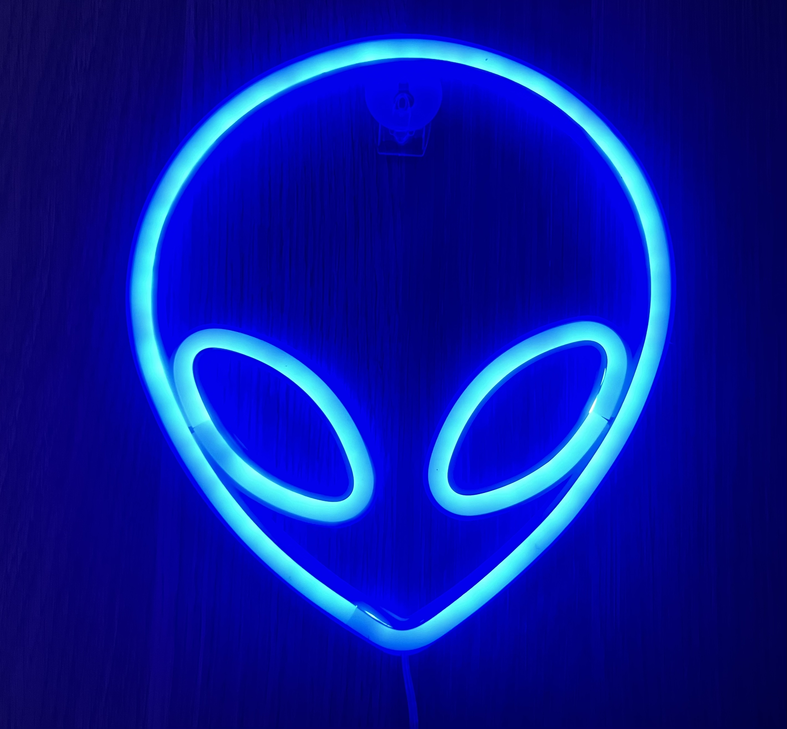
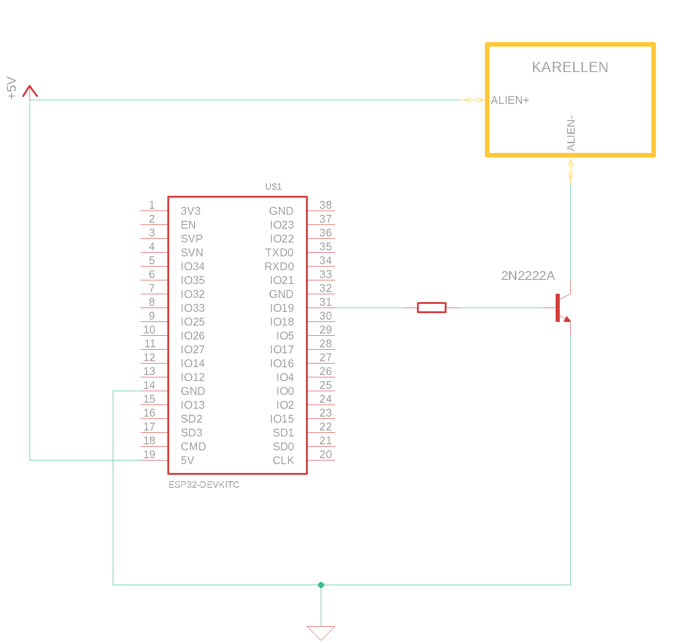

# Karellen

   

Karellen is an experiment to test the Matter protocol on the ESP32 platform.

You can read a nice blog post [here](https://ramomar.medium.com/karellen-fa014669f566) (spanish).

## Features

- Toggles a cool LED Alien neon sign by integrating the chip with the Apple Home platform using the Matter framework.

## Building and flashing

1. [Setup the Matter framework](https://github.com/project-chip/connectedhomeip/blob/master/docs/guides/BUILDING.md#installing-prerequisites-on-macos).
2. [Setup Espressif IoT Development framework](https://github.com/project-chip/connectedhomeip/blob/master/docs/guides/esp32/setup_idf_chip.md).
3. [Setup your Apple devices](https://github.com/project-chip/connectedhomeip/blob/master/docs/guides/darwin.md).
4. Run `idf.py build`.
5. Run `idf.py -p /dev/cu.<PORT> flash monitor`.

## Notes and TODO

- I used the [ESP32-DevKitC-1](https://docs.espressif.com/projects/esp-idf/en/latest/esp32s3/hw-reference/esp32s3/user-guide-devkitc-1.html#ordering-information) with the [ESP32-S3-WROOM-1-N8R8 module](https://docs.espressif.com/projects/esp-idf/en/latest/esp32s3/hw-reference/esp32s3/user-guide-devkitc-1.html#ordering-information).
- The ESP32 lighting app example was used as the base for this project.
- The example was build in order to showcase RGB LEDs, I tried to generate my own config so as to drop the useless cluster definitions but was unable to get a passing build using the generated code from the ZAP tool. I easily spent +5 hours testing different configurations to no avail.
- For the Pigweed backends, I didn't implement mine and opted to use the ones from the example files.
- I was [unable to commission the device using the CHIP tool](https://github.com/project-chip/connectedhomeip/issues/23435) but was successful when using the Apple Home app.
- Sometimes when the device is cut from power it is [unable to re-establish a session](https://github.com/project-chip/connectedhomeip/issues/22040). So some debugging is needed there. 

## Github issues and ESP32 references

- https://github.com/project-chip/connectedhomeip/issues/19499
- https://github.com/project-chip/connectedhomeip/issues/22040
- https://github.com/project-chip/connectedhomeip/issues/23435
- https://www.espressif.com/sites/default/files/documentation/esp32-s3-wroom-1_wroom-1u_datasheet_en.pdf
- https://docs.espressif.com/projects/esp-idf/en/latest/esp32s3/hw-reference/esp32s3/user-guide-devkitc-1.html#ordering-information

## Reference schematic

   

